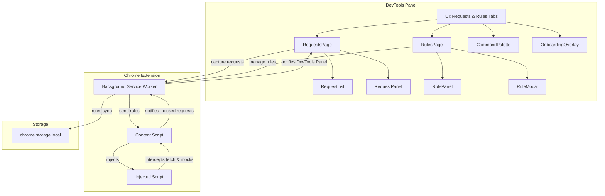

# GraphQLens

GraphQLens is a modern, performant Chrome DevTools extension (Chrome only) for inspecting and mocking GraphQL network traffic. It provides a powerful UI for developers to capture, analyze, and mock GraphQL requests and responses directly within the browser, with all data stored locally for privacy.

## Features

- **Live GraphQL Capture:** Automatically records GraphQL POST requests as you browse, including both real and mocked responses.
- **Request Inspection & Diff:** Select any request to view its query, variables, and compare original vs. transformed (mocked) responses.
- **Powerful Mocking Engine:** Create rules to mock GraphQL responses per endpoint, operation, and variables. Supports status codes and response bodies.
- **Rule Management:** Import, export, duplicate, bulk delete, and edit rules. Rules are stored in browser storage and can be synced across tabs.
- **Keyboard Navigation & Command Palette:** Use <kbd>Cmd/Ctrl + K</kbd> to open a command palette for quick actions. Navigate requests with arrow keys and create rules with <kbd>Enter</kbd>.
- **Snappy UI:** Virtualized lists, minimal re-rendering, and debounced parsing for high performance, even with large traffic.
- **Privacy-First:** All data and rules are stored locally. No remote calls or telemetry.
- **DX:** Built with pnpm, Vite, TypeScript, ESLint, Prettier, TailwindCSS, Zustand, and Radix UI.

## Build System

- Uses [`@crxjs/vite-plugin`](https://github.com/crxjs/chrome-extension-tools) to bundle the extension for Chrome.
- All build configuration is in `vite.config.ts`.
- Outputs to the `dist/` directory for loading as an unpacked extension.

## Quick Start

```bash
pnpm install
pnpm build
```

Then load the `dist/` directory as an **Unpacked extension** in `chrome://extensions`.

## Scripts

- `pnpm dev` – Run DevTools app in watch mode and rebuild extension pieces
- `pnpm build` – Build all extension targets
- `pnpm lint` – Lint the codebase
- `pnpm format` – Format the codebase

## Architecture

## Manifest & Permissions

- **Manifest Version:** 3
- **Permissions:** `storage`, `scripting`, `tabs`
- **Host Permissions:** `<all_urls>`
- **Background:** Service worker (`src/background/index.ts`)
- **Content Scripts:** `src/content/index.ts` (runs on all URLs)
- **Web Accessible Resources:** `src/injected/index.js`

See `extension/manifest.json` for full details.



**Key Components:**

- **DevTools Panel:** Main UI, built with React, provides two tabs: Requests (live capture and inspection) and Rules (mocking management).
- **Background Service Worker:** Handles persistent storage, rule synchronization, and communication between DevTools, content scripts, and injected scripts.
- **Content Script:** Injects the fetch-intercepting script into the page and bridges messages between the page and the extension.
- **Injected Script:** Intercepts `fetch` calls for GraphQL POSTs, applies mock rules, and returns mocked responses if enabled.
- **Storage:** All rules and settings are stored in `chrome.storage.local`.

## Permissions

- `storage`: Store rules and settings locally
- `scripting`: Inject scripts for mocking
- `tabs`: Communicate with inspected tabs
- `devtools_page`: Register DevTools panel
- `host_permissions`: `<all_urls>` (only used when mocking is enabled)

## Privacy

All data stays in your browser storage. No remote calls or telemetry are made. Rules, captured requests, and settings never leave your machine.

---

## Usage

1. **Open DevTools:** After installing, open Chrome DevTools and switch to the **GraphQLens** tab.
2. **Capture Traffic:** Trigger GraphQL requests in the inspected page. They will appear in the Requests tab.
3. **Inspect & Diff:** Click a request to view its query, variables, and compare original vs. mocked responses.
4. **Create Mock Rules:** Click "New rule" in the Rules tab, or select a request and press <kbd>Enter</kbd> to create a rule from it.
5. **Enable Mocking:** Use the Mocking toggle in the header to activate/deactivate mocking.
6. **Import/Export Rules:** Use the buttons in the Rules tab to import/export rule sets as JSON.
7. **Keyboard Shortcuts:**
   - <kbd>Cmd/Ctrl + K</kbd>: Open command palette
   - <kbd>↑/↓</kbd>: Navigate requests
   - <kbd>Enter</kbd>: Create rule from selected request

## Onboarding & Help

On first launch, an onboarding overlay will guide you through the main features. You can revisit these concepts later in the Help section (coming soon).

## Contributing

Pull requests are welcome! To contribute:

1. Fork the repository and create a new branch.
2. Run `pnpm install` to set up dependencies.
3. Use `pnpm dev` for development and `pnpm lint`/`pnpm format` to ensure code quality.
4. Submit your PR with a clear description of your changes.

For questions or issues, please open an issue on GitHub.

## Development

This project uses pnpm, Vite, TypeScript, React, Zustand, TailwindCSS, and Radix UI. See `package.json` for all dependencies.

---

## License

GPL-3.0-only
